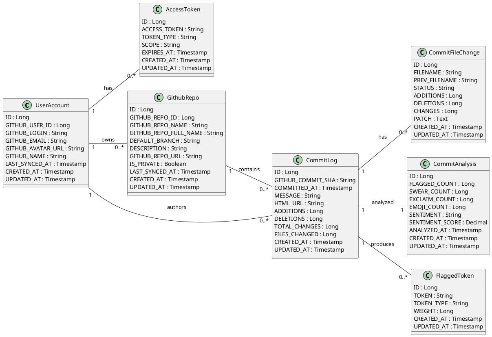

# 📋 클래스 다이어그램

> [!NOTE]
> 본 문서는 CommitMood 서비스의 핵심 도메인 객체와 그 관계를 클래스 다이어그램 관점에서 정의합니다.  
> 사용자, GitHub 리소스, 커밋 데이터, 분석 결과 간의 구조적 관계를 명확히 하는 것을 목적으로 합니다.

 

## 📋 목차

- [📦 클래스 다이어그램 개요](#-클래스-다이어그램-개요)
- [👤 사용자 및 인증 도메인](#-사용자-및-인증-도메인)
- [📁 GitHub 리포지토리 도메인](#-github-리포지토리-도메인)
- [📝 커밋 데이터 도메인](#-커밋-데이터-도메인)
- [🧠 분석 및 키워드 도메인](#-분석-및-키워드-도메인)
- [🔗 클래스 관계 요약](#-클래스-관계-요약)
- [📐 클래스 다이어그램 PlantUML](#-클래스-다이어그램-plantuml)

 

## 📦 클래스 다이어그램 개요

> [!NOTE]
> CommitMood의 클래스 다이어그램은 실제 MySQL 스키마(DDL)를 기준으로 작성되며,  
> 각 클래스는 데이터 저장 단위이자 도메인 개념을 표현합니다.

- 사용자 계정과 GitHub 계정의 관계 정의
- 리포지토리와 커밋 데이터의 소유 구조 표현
- 커밋 분석 결과 및 감정 키워드 구조 명시
- 랭킹 및 통계 산출을 위한 데이터 흐름 기반 설계

 

## 👤 사용자 및 인증 도메인

### 👤 UserAccount

- 설명  
  CommitMood 서비스를 이용하는 사용자 계정을 표현합니다.  
  GitHub 사용자 정보와 서비스 내 사용자 정보를 함께 관리합니다.

- 주요 속성
    - ID
    - GITHUB_USER_ID
    - GITHUB_LOGIN
    - GITHUB_EMAIL
    - GITHUB_NAME
    - LAST_SYNCED_AT

 

### 🔐 AccessToken

- 설명  
  GitHub OAuth 인증을 통해 발급받은 Access Token 정보를 관리합니다.  
  GitHub API 호출 시 인증 수단으로 사용됩니다.

- 주요 속성
    - ID
    - ACCESS_TOKEN
    - TOKEN_TYPE
    - SCOPE
    - EXPIRES_AT

 

## 📁 GitHub 리포지토리 도메인

### 📁 GithubRepo

- 설명  
  사용자가 소유하거나 기여한 GitHub 리포지토리를 표현합니다.  
  커밋 데이터 수집의 기준 단위입니다.

- 주요 속성
    - ID
    - GITHUB_REPO_ID
    - GITHUB_REPO_NAME
    - GITHUB_REPO_FULL_NAME
    - DEFAULT_BRANCH
    - IS_PRIVATE
    - LAST_SYNCED_AT

 

## 📝 커밋 데이터 도메인

### 📝 CommitLog

- 설명  
  GitHub 리포지토리에서 수집된 개별 커밋 정보를 표현합니다.  
  분석 및 통계 산출의 최소 단위 데이터입니다.

- 주요 속성
    - ID
    - GITHUB_COMMIT_SHA
    - COMMITTED_AT
    - MESSAGE
    - ADDITIONS
    - DELETIONS
    - TOTAL_CHANGES

 

### 📄 CommitFileChange

- 설명  
  하나의 커밋에 포함된 파일 변경 내역을 표현합니다.  
  파일 단위 변경 분석을 위한 세부 데이터입니다.

- 주요 속성
    - ID
    - FILENAME
    - STATUS
    - ADDITIONS
    - DELETIONS
    - CHANGES

 

## 🧠 분석 및 키워드 도메인

### 🧠 CommitAnalysis

- 설명  
  커밋 메시지를 기반으로 수행된 감정 및 키워드 분석 결과를 표현합니다.  
  각 커밋당 하나의 분석 결과를 가집니다.

- 주요 속성
    - ID
    - FLAGGED_COUNT
    - SWEAR_COUNT
    - EXCLAIM_COUNT
    - EMOJI_COUNT
    - SENTIMENT
    - SENTIMENT_SCORE
    - ANALYZED_AT

 

### 🏷️ FlaggedToken

- 설명  
  커밋 메시지에서 추출된 감정 키워드 또는 특수 토큰 정보를 표현합니다.  
  분석 결과 상세 정보를 구성합니다.

- 주요 속성
    - ID
    - TOKEN
    - TOKEN_TYPE
    - WEIGHT

 

## 🔗 클래스 관계 요약

- UserAccount는 여러 개의 AccessToken을 가질 수 있습니다.
- UserAccount는 여러 개의 GithubRepo를 소유할 수 있습니다.
- GithubRepo는 여러 개의 CommitLog를 포함합니다.
- CommitLog는 여러 개의 CommitFileChange를 가질 수 있습니다.
- CommitLog는 하나의 CommitAnalysis를 가집니다.
- CommitLog는 여러 개의 FlaggedToken을 가질 수 있습니다.

 

## 📐 클래스 다이어그램 PlantUML

 

> [!NOTE]
> 본 클래스 다이어그램은 유스케이스 다이어그램과 ERD를 기반으로 작성되었으며, API 명세, 시퀀스 다이어그램, 서비스 설계의 기준 문서로 활용됩니다.